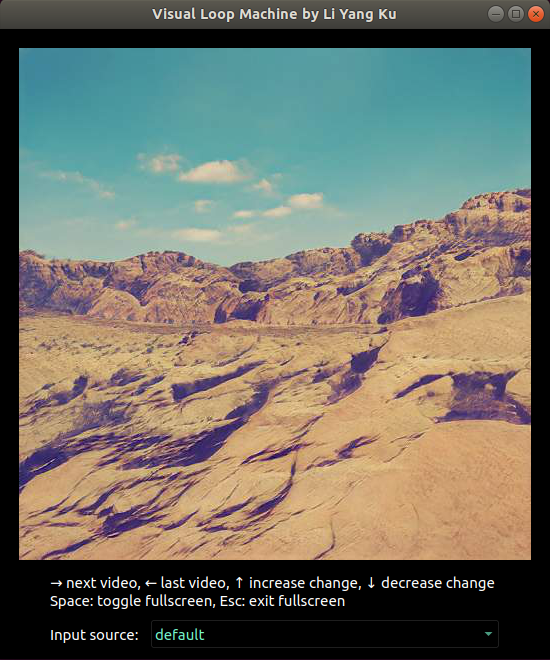

Visual Loop Machine
###################

Visual Loop Machine plays visual loops stored in the MTD (Multiple Temporal Dimension) video format. The visual loop
changes according to the loudness of the audio playing on the same computer.

| More details here: https://computervisionblog.wordpress.com/2022/04/30/visual-loop-machine/

Example videos:
 | https://youtu.be/9IMoNuqwvhs
 | https://youtu.be/jDYyhgoLwZ0

Quickstart
==========
Create virtual environment and install v_machine

First download repository.

.. code-block:: console

    $ git clone https://github.com/goolygu/v_machine.git

For Linux users, you may need to install portaudio.

.. code-block:: console

    $ sudo apt-get install libportaudio2

Make virtual environment and install packages.

.. code-block:: console

    $ cd v_machine
    $ make venv

Place mtd videos to play under the mtd_video folder (Samples are provided.) You can download mtd videos
created by me here https://drive.google.com/drive/folders/16wlG6fFPS-srPqVNeYKTvZyl0b4hTfPi?usp=sharing

Activate virtual environment and run the following command to start

.. code-block:: console

    $ source venv/bin/activate
    $ python src/v_machine/v_machine.py

There is a drop down menu where you can select the input source as shown in the image above.

For Mac users, the default input is usually microphone only, for getting input from the music directly
you may need to install soundflower https://rogueamoeba.com/freebies/soundflower/ and create an aggregated device so
that your output goes to both your stereo and the visual loop machine.
